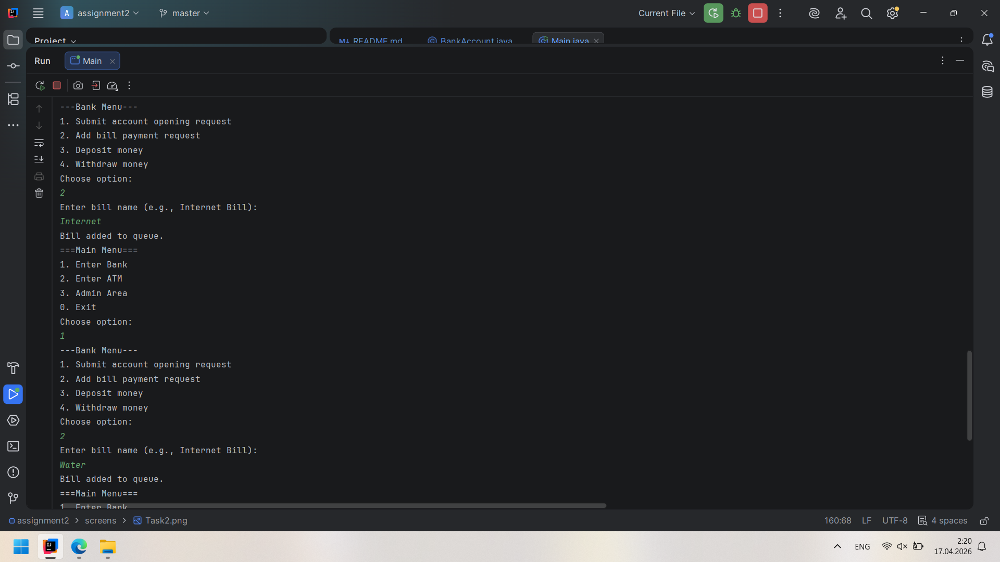
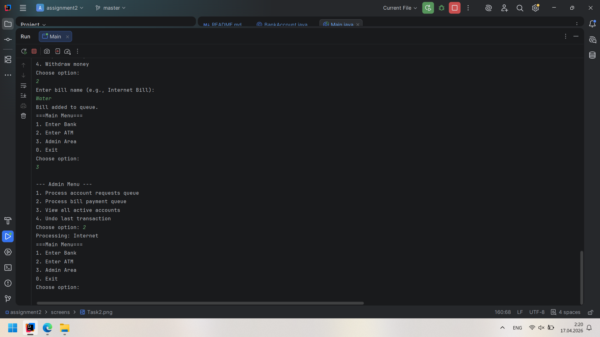
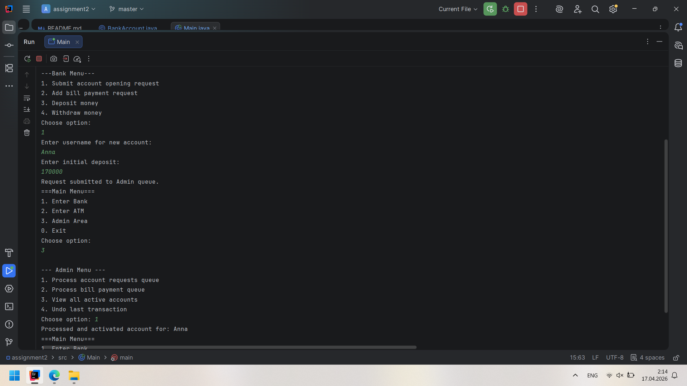

# Assignment 2:  Physical & Logical Data Structures (Banking System)
**Student:** Alima Beisembayeva
**Group:** IT-2504
## Tasks Implementation
### Task 1:  Bank Account Storage Using LinkedList
* **Description:** implemented a dynamic LinkedList to store user accounts
* **Screen:**
### Task 2:  Deposit & Withdraw Operations
* **Description:** I developed efficient search and update logic within the list to handle core banking transactions
* **Screen:** 
### Task 3: Transaction History (Stack – LIFO)
* **Description:** utilized a Stack to record transaction history, enabling the "Undo" feature by following the LIFO principle.
* **Screen:** 
### Task 4: Bill Payment Queue (Queue – FIFO)
* **Description:** Applied the FIFO principle using a Queue to ensure that bill payments are processed in the order they were received.
* **Screen:**  
### Task 5: Account Opening Queue (Admin Simulation)
* **Description:** I used a Queue to hold pending requests and transferred them to a dynamic LinkedList upon admin approval.
* **Screen:** 
### Task 6:  Physical Data Structures
* **Description:** implemented a physical array with a fixed size to demonstrate how static memory structures store VIP accounts.
* **Screen:** 
### Part 3: Mini Banking Menu
* **Description:** integrated all data structures into a unified system with separate interfaces for Bank, ATM, and Admin roles.
* **Screen:** 

## Work Process Summary
I learned how to work with new "Import Statements", also I refresh my knowledge to how create and work with switch and case.
