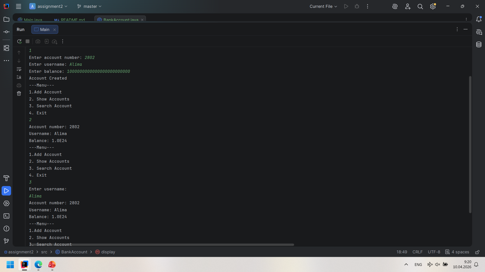
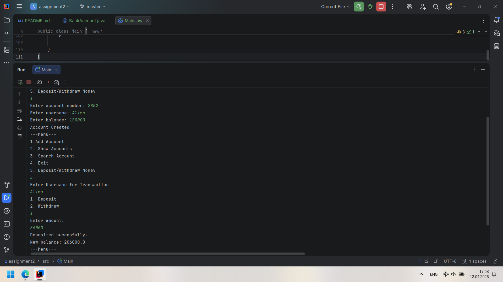
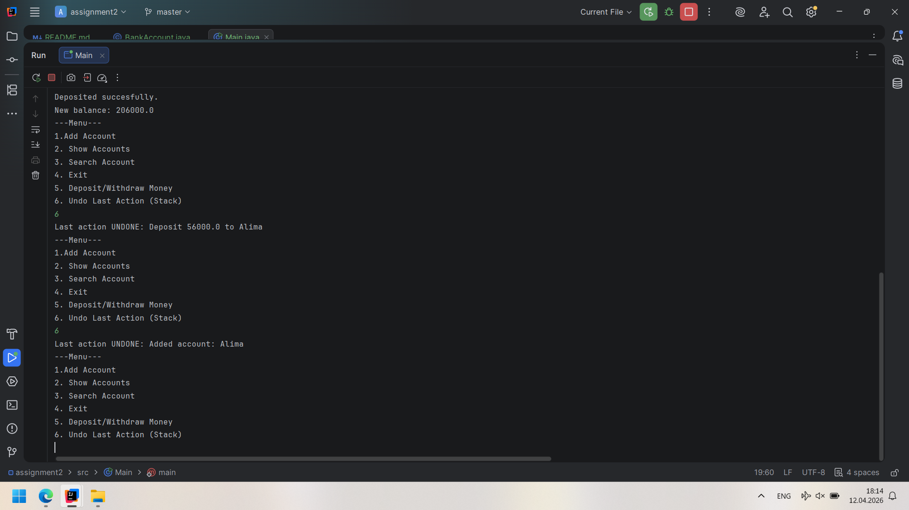
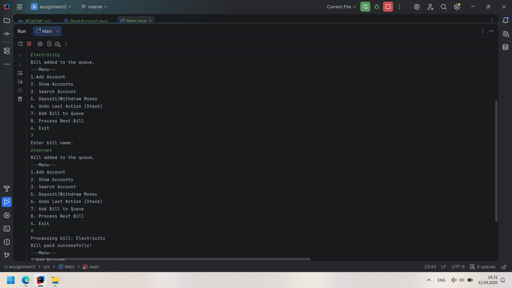
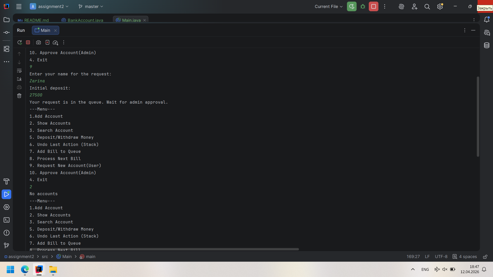
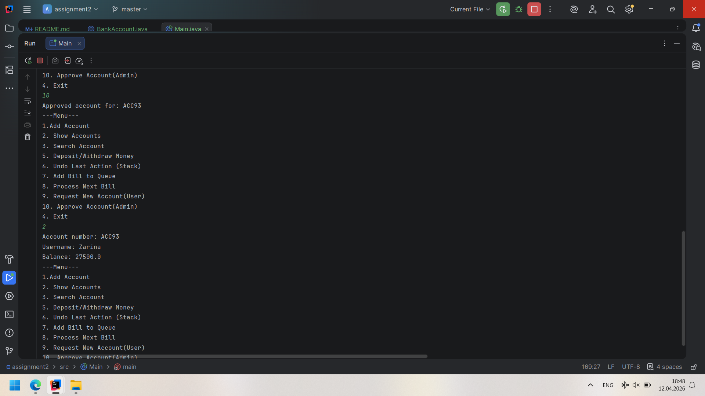
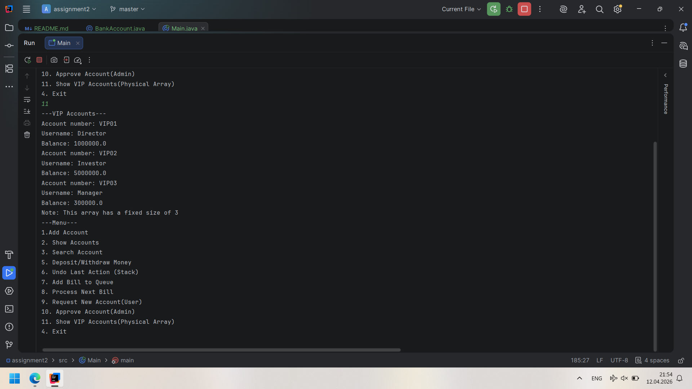
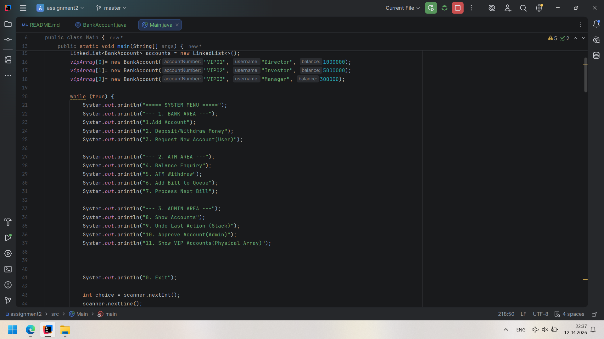

# Assignment 2:  Physical & Logical Data Structures (Banking System)
**Student:** Alima Beisembayeva
**Group:** IT-2504
## Tasks Implementation
### Task 1:  Bank Account Storage Using LinkedList
* **Description:** Created a code that stores, displays and sorts bank accounts by name.
* **Screen:**
### Task 2:  Deposit & Withdraw Operations
* **Description:** Added two functions: deposit and withdraw in BankAccount class. Also added "case 5" for these functions in Main class.
* **Screen:** 
### Task 3: Transaction History (Stack – LIFO)
* **Description:** Added new "case 6" to check the history of actions. Also modifies "case 1" and "case 5" to connect it with method "transactionHistory".
* **Screen:** 
### Task 4: Bill Payment Queue (Queue – FIFO)
* **Description:** Added new cases 7 and 8 to add bill payments and for processing them.
* **Screen:** 
### Task 5: Account Opening Queue (Admin Simulation)
* **Description:** Added case 9 for user application and case 10 for admin simulation.
* **Screen:**  
### Task 6:  Physical Data Structures
* **Description:** used array to create fixed data with a fixed number of cells.
* **Screen:** 
### Task 7: Mini Banking Menu
* **Description:** Divided cases to three menu types.
* **Screen:** 

## Work Process Summary
I learned how to work with new "Import Statements", also I refresh my knowledge to how create and work with switch and case.
